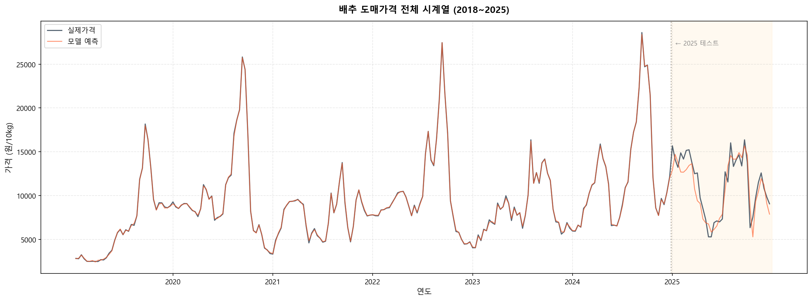
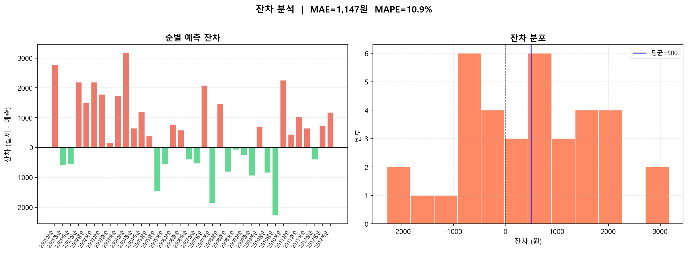

# 배추 도매 평균가격 순별 예측 모델

XGBoost 기반 머신러닝을 활용하여 배추 도매 평균가격을 **순별(상순/중순/하순)** 단위로 예측하는 모델입니다.

## 1. 프로젝트 개요

본 프로젝트는 가격, 기상, 반입량, 검색량 등 **5개 데이터 소스**를 활용하여 배추 도매가격의 단기 예측 모델을 구축합니다.

- **학습 기간**: 2018~2024년 (252개 순별 데이터)
- **테스트 기간**: 2025년
- **예측 단위**: 순별 (월 3회: 상순/중순/하순)

## 2. 데이터

| 데이터 | 파일명 | 주요 변수 | 출처 |
|--------|--------|-----------|------|
| 가격 | `가격데이터_순별.csv` | 평균가격, 전년가, 평년가 | 농산물유통정보 (KAMIS) |
| 해남 기상 | `Haenam_순별.csv` | 기온, 강수량, 일사량 등 8개 | 기상청 |
| 태백 기상 | `TaeBak_순별.csv` | 기온, 강수량, 일사량 등 8개 | 기상청 |
| 반입량 | `배추반입량_순별.csv` | 총반입량 | 농산물유통정보 |
| 검색량 | `search_순별.csv` | 평균 검색량 | 네이버 데이터랩 |

### 기상 데이터 활용 규칙

배추의 주산지가 계절에 따라 다른 점을 반영하여, 기상 데이터를 조건부 병합합니다.

- **7~9월 (여름)**: 태백 고랭지 기상 데이터 사용 (고랭지 배추 출하기)
- **그 외 (10~6월)**: 해남 기상 데이터 사용 (월동 배추 주산지)

## 3. 방법론

### 3.1 피쳐 엔지니어링

총 **77개 후보 피쳐**를 생성하며, importance 기반으로 최종 **32개**를 선별합니다.

| 카테고리 | 피쳐 | 설명 |
|----------|------|------|
| 가격 시계열 | `plag1`~`plag36`, `pma3/6/12`, `pstd3/6` | lag, 이동평균, 변동성 |
| 가격 파생 | `pmom3`, `pyoy`, `p_vs_py`, `p_vs_jn` | 모멘텀, 전년비, 평년비 |
| 반입량 | `slag1~3`, `sma3/6`, `schg`, `ps_ratio` | lag, 이동평균, 가격/반입 비율 |
| 검색량 | `srlag1~18`, `srma3` | lag, 이동평균 |
| 기상 | `{기상변수}_l{1,3,6,9}` | 8개 기상변수 × 4개 시차 |
| 기상 파생 | `temp_range`, `heat/cold_stress`, `heavy_rain` | 한파, 폭염, 폭우 지표 |
| 달력 | `msin/mcos`, `pysin/pycos`, `kimchi`, `summer` | 계절 순환 인코딩 |

### 3.2 모델

- **알고리즘**: XGBoost (Gradient Boosted Trees)
- **하이퍼파라미터**: `n_estimators=500`, `max_depth=3`, `learning_rate=0.05`, `subsample=0.8`, `colsample_bytree=0.8`
- **평가 방법**: TimeSeriesSplit 5-Fold 교차검증 + 2025년 Hold-out 테스트

## 4. 결과

### 4.1 성능 지표

| 지표 | 테스트 (2025) | CV 평균 |
|------|:---:|:---:|
| R² | **0.82** | 0.53 |
| RMSE | ~1,400 | - |
| MAPE | ~12% | - |

> CV 평균이 낮은 이유: TimeSeriesSplit 특성상 초기 Fold는 학습 데이터가 적고, Fold 2 (2020년 검증)는 COVID-19 시기의 급격한 가격 변동으로 인해 R²가 음수를 기록합니다.

### 4.2 2025년 예측 결과


2025년 순별 실제가격과 예측가격을 비교한 그래프입니다. 각 데이터포인트에 오차율(%)이 표시되어 있습니다.

### 4.3 실제 vs 예측 산점도


### 4.4 피쳐 중요도


가격 시계열 피쳐(`plag1`, `pma3`, `pmom3`)가 가장 높은 중요도를 보이며, 기상 변수 중에서는 최저초상온도와 기온 관련 피쳐가 상위에 위치합니다.

### 4.5 전체 시계열



2018~2025년 전체 기간의 실제가격과 모델 예측을 비교합니다. 오른쪽 음영 영역이 2025년 테스트 구간입니다.

### 4.6 잔차 분석



### 4.7 교차검증 결과


## 5. 프로젝트 구조

```
cabbage/
├── README.md
├── 배추가격_최종모델_v2.py       # 메인 예측 모델
├── 배추가격_최종모델.py          # 모델 분석/실험용 (최적 피쳐 동적 선별형)
├── data/                         # 원본 데이터
│   ├── 가격데이터_순별.csv
│   ├── Haenam_순별.csv
│   ├── TaeBak_순별.csv
│   ├── 배추반입량_순별.csv
│   └── search_순별.csv
└── results/                      # 결과 출력
    ├── model_metrics.json
    ├── plots/                    # 시각화 (6개)
    │   ├── result_2025_prediction.png
    │   ├── result_scatter.png
    │   ├── result_feature_importance.png
    │   ├── result_full_timeseries.png
    │   ├── result_residuals.png
    │   └── result_cv_results.png
    └── predictions/              # 예측 CSV
        └── result_2025_predictions.csv
```

## 6. 실행 방법

### 요구사항

```
Python >= 3.9
xgboost
scikit-learn
pandas
numpy
matplotlib
```

### 설치 및 실행

```bash
pip install xgboost scikit-learn pandas numpy matplotlib

python 배추가격_최종모델_v2.py
```

실행 시 터미널에 학습 과정, CV 결과, 테스트 성능, 순별 예측 상세가 출력되며, `results/` 폴더에 시각화 이미지와 예측 CSV가 저장됩니다.

## 7. 한계점 및 향후 과제

- **데이터 규모**: 순별 288개 관측치로 시계열 학습에는 다소 부족한 규모
- **외부 변수 부재**: 재배면적, 작황 조사, 수입량, 정부 수급 정책 등 가격에 영향을 미치는 주요 변수가 미포함
- **COVID-19 구간**: 2020년 전후 급격한 가격 변동 패턴이 모델 학습을 어렵게 하는 요인
- **향후 과제**: LSTM 등 딥러닝 시계열 모델 적용, 외부 데이터 확충, 앙상블 기법 고도화
